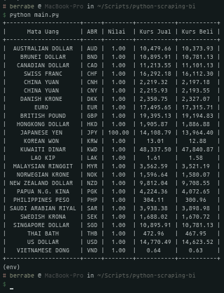

<p align="center">
  
</p>


### TLDR;
---
Script python ini di buat untuk mengambil data dari website BANK INDONESIA terkait dengan kurs mata uang indonesia terhadap mata uang negara lain, tools yang di butuhkan untuk menjalankan program ini hanya python dan pip versi 3

untuk cara penggunaan detail nya, ikuti langkah di bawah ini :

```sh
git clone https://github.com/berrabe/python-bank-indonesia.git
cd python-bank-indonesia
pip install -r requirements.txt
python main.py
```

### SCREENSHOT
---
<p align="center">
  
</p>
